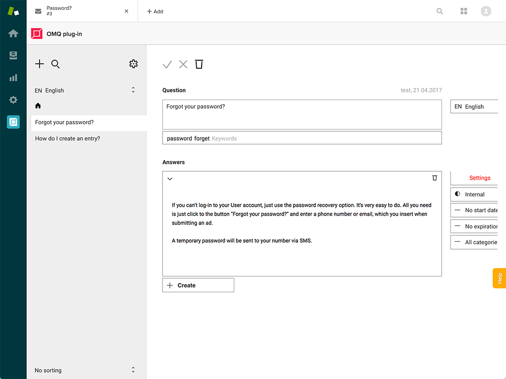
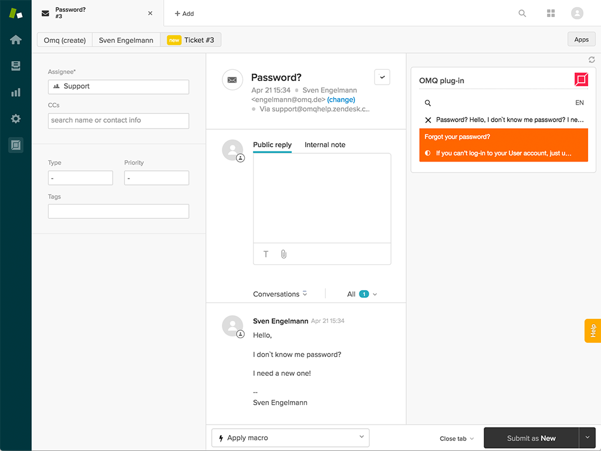
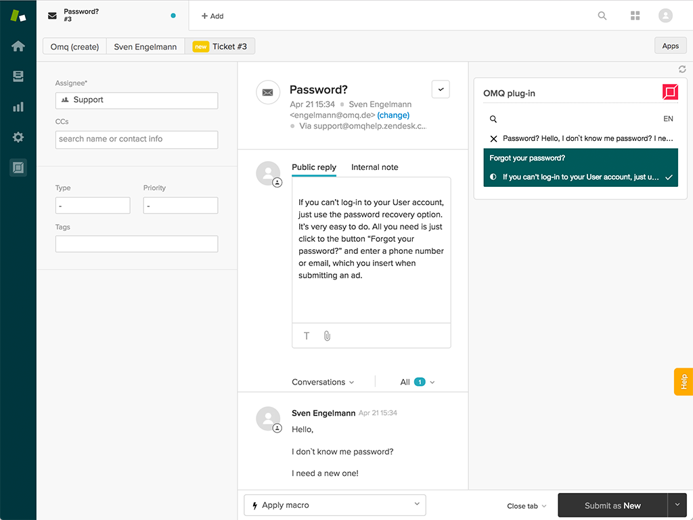

# OMQ Assist for Zendesk

## Description

[OMQ Assist](https://www.omq.ai/products/assist/) makes Zendesk more **efficient** and helps you to deliver great customer service.

## Features include:

- Answer support tickets with one click
- Solve requests from all over the world (supports 32 languages)
- OMQ AI learns from your support tickets (self learning)
- Rights management for agents
- Work in the OMQ knowledge base without leaving Zendesk

The latest stable version of the extension can be installed via the [Zendesk Marketplace](https://www.zendesk.com/apps/support/omq-assist/).

## OMQ Assist
 
OMQ Assist enhances your ticket system with a **self-learning** knowledge base, which automatically suggests suitable solutions. The processing time of each individual ticket is reduced, because of the extremely shortened research process. As soon as a ticket or a customer email is opened in Zendesk, OMQ Assist reads the message automatically. The **Artificial Intelligence** of OMQ understands the customer’s request and OMQ Assist proposes matching entries from the **knowledge base**. These appear in the right pane of Zendesk Support.

You can also individually search for an answer if you want to use a different answer than the one suggested by OMQ Assist. Just enter a search term in the **search field**. OMQ Assist displays all entries for this search term. The number in the first place indicates how many entries for the term are stored in the knowledge base as a whole. Below is listed which specific entries there are related to the term and how many of them exist.

## Screenshots

Ticket preview | Assist preview | Admin preview
------------ | ------------- | ----------------
 |  | 

## About OMQ

[OMQ](https://www.omq.ai) is a central and intelligent knowledge base. All OMQ products access the same service answers from the **knowledge base** and direct them into the various communication channels.

## OMQ’s AI understands the customer’s intent

With our [artificial intelligence](https://www.omq.ai/blog/artificial-intelligence-in-customer-service/), incoming customer messages will be **automatically** read. Simultaneously, OMQ Assist analyzes and understands the **intention** of the customer request. Text blocks will be displayed to the **service agent** so that they can compose an email reply with a single click. Manually replying to repetitive customer requests will therefore be avoided.

## How to install the Zendesk app

Go to the [Zendesk Marketplace](https://www.zendesk.com/apps/support/omq-assist/).
Install the plugin. Click on the OMQ tab on the left menu sidebar to create a new OMQ account. Follow the [instructions](https://www.omq.ai/blog/zendesk-omq-assist/).

Integration with **Zendesk** uses an **API key**. This is used to identify the connection in the ticket system. New customers create a free OMQ account during the integration process. The API is generated automatically in the process. OMQ customers who already have an account can generate an API key for a new Assist connection in the OMQ knowledge base under the **Assist** module. This is automatically generated via the plus-icon in the left corner.

## Contribution

Improvements to the extension are always welcome. To contribute, please contact [OMQ](https://www.omq.ai/company/contact/).

## Bugs

Please submit bug reports to [support@omq.ai](mailto:support@omq.ai).
