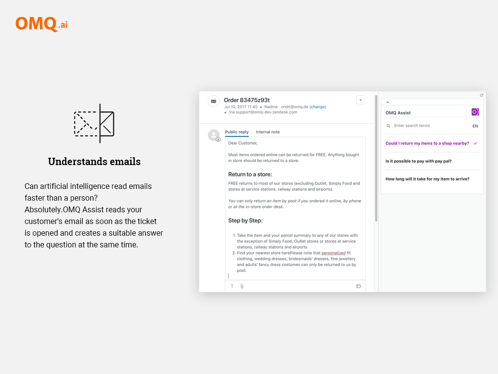
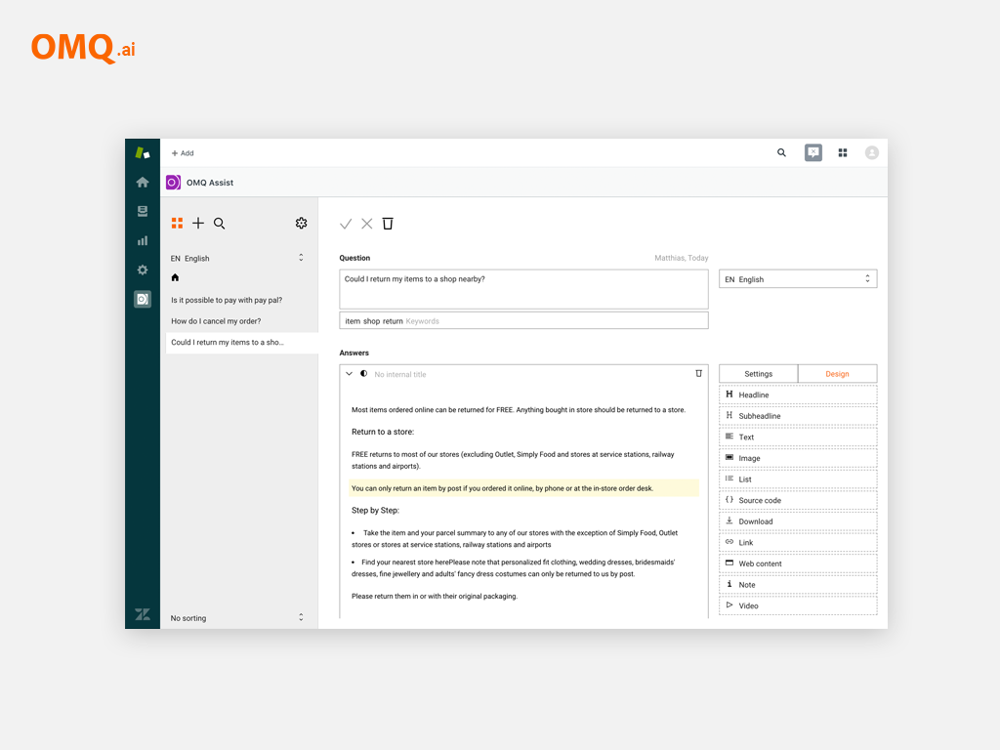

# OMQ Assist for Zendesk - scalable customer service with AI!

With OMQ Assist for Zendesk you will provide the **best customer service**.

[OMQ Assist](https://www.omq.ai/products/assist/) **supports your agents** to reply faster and reduce manual work. The artificial intelligent understand every **support ticket** and give your agent a overview of solutions. OMQ Assist is connected with the OMQ knowledge base to collect all important information. The OMQ Assist Zendesk app is **available in 32 languages**. The rights management makes it **easy** to manage different roles.

## Screenshots

Ticket preview | Assist preview | Admin preview
------------ | ------------- | ----------------
 |  | 

## Benefits OMQ Assist

 - Automatic identification of solutions 
 - Self-learning knowledge base
 - Simple answer choice even with multiple problems in a request 
 - Easy detection of the contents of the customer request 
 - Individual processing of customer response

## Newest Version

We are constantly evolving our systems further. 
**You will find the newest Version of OMQ Assist in the [Zendesk Marketplace](https://www.zendesk.com/apps/support/omq-assist/?q=mkp_omq).**

## Installation

The installation of OMQ Assist in **Zendesk** is very easy. You don't need expert knowledge. To connect Zendesk with OMQ you need a API key and an active OMQ account. The test period is **free** and takes only a few minutes.

**For the installation you can follow the instructions in the [article](https://www.omq.ai/blog/zendesk-omq-assist/).**

## About us

[OMQ](http://www.omq.ai/) answers customer service requests by using artificial intelligence.

With the **intelligent knowledge base** you can control every information what you want that is important for your customer. No matter if **chat, FAQ or another contact channel**, you can provide the information to your customers everywhere.

## Feedback & Bugs

Please [contact us](https://www.omq.ai/company/contact/) if you have any suggestions for improvement.
