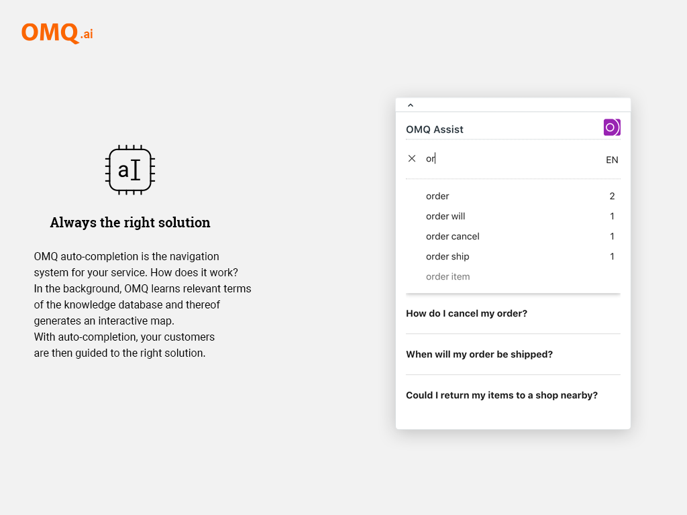

# OMQ assist for Zendesk

### Description

OMQ assist enhances your ticket system with a self-learning knowledge base, which automatically suggests suitable solutions. The processing time of each individual ticket is reduced, because of the extremely shortened research process.

### How to install

Go to the [Zendesk Marketplace](https://www.zendesk.com/apps/support/omq-assist/?q=mkp_omq).
Install the plugin. Click on the OMQ tab on the left menu sidebar to create a new OMQ account. Follow the instructions.

### Screenshots

Ticket preview | Assist preview | Admin preview
------------ | ------------- | ----------------
 |  | 
